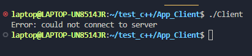

<h1 align=center>C++ Programmer Technical test</h1>

<div align=center>
<a href="#description">Description</a> |
<a href="#tech">Tech Stack</a> |
<a href="#clone">Clone Project</a> |
<a href="#launch">Execution</a> 
</div>


<div id="description"></div>

## Description


This project is Written in C++, consists on a Client/Server application. The Server awaits for conections and every 30 seconds if has at least one conection randomly picks a client and set a message to get its current time.


<div id="tech"></div>

## Tech Stack

**Language:** C++

<div id="requirements"></div>

## Requirements


 * Git

<div id="clone"></div>

## Clone the project


To be able to execute the project the first thing to do is clone this repository 


<div id="launch"></div>

## Execution 

To be able to exectute the project we first need to compile the scripts in a linux machine or wsl in windows.

**Compile server**

Open the console in the Server app and run the following command.

```
cc Server.cpp -lstdc++ -o Server
```

**Compile client**

Open the console in the Client app and run the following command.

```
cc Client.cpp -lstdc++ -o Client
```

**Run the compiled files**

First start the server by running the following command.

```
./Server
```


Then start the client by running the following command.

```
./Client
```


If the client starts before the server, an error will be displayed and the application will be closed.





If everything is OK, the server will create an app.log file and will start to write the required information by choosing a random client every 30 seconds.


